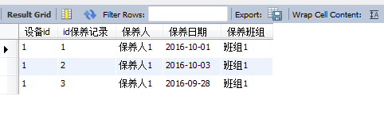

## ER图：

***

## 数据库查询语句：
* 查询设备编号为1的材料消耗情况:

`
USE wkud;
select 材料配件id,SUM(材料配件数量) as 数量
from 保养记录 BJ,保养 B,修理 S,配件 P
where B.设备id=1 and BJ.保养id=B.id保养 and S.保养记录id=BJ.id保养记录 and P.id配件=S.材料配件id
GROUP BY S.材料配件id;
`

* 查询设备编号为1的历史检修情况:

`
USE wkud;
select B.设备id,BJ.id保养记录,BJ.保养人,BJ.保养日期,BJ.保养班组
from 保养记录 BJ,保养 B
where B.设备id=1 and BJ.保养id=B.id保养;
`

* 查询设备编号为1，保养记录id为1的保养条目即完成情况:

`
USE wkud;
select BJ.id保养记录,B.设备id,BX.保养内容,S.是否完好 AS 是否完好,S.材料配件id,S.材料配件数量
from 保养 B JOIN 保养项目 BX on
BX.设备类别id=B.设备类别id,修理 S JOIN 保养记录 BJ ON S.保养记录id=BJ.id保养记录
where BJ.id保养记录=1 and B.设备id=1 and
BX.id保养项目=S.保养项目id;
`

* 查询设备编号为1的保养条目:

`
USE wkud;
select B.设备id,BX.保养内容
from 保养 B,保养项目 BX
where BX.设备类别id=B.设备类别id and B.设备id=1;
`

* 根据当前时间预警所有该检修的设备:

`
USE wkud;
select SB.设备号
from 设备 SB,检修类型 JX,(select B.设备id as id,max(BJ.保养日期) as timee from 保养记录 BJ,保养 B where BJ.保养id=B.id保养 group by B.设备id) AS T
where T.id=SB.id设备 and JX.检修周期-DATEDIFF(now(),T.timee)<SB.提前预警天数;
`

